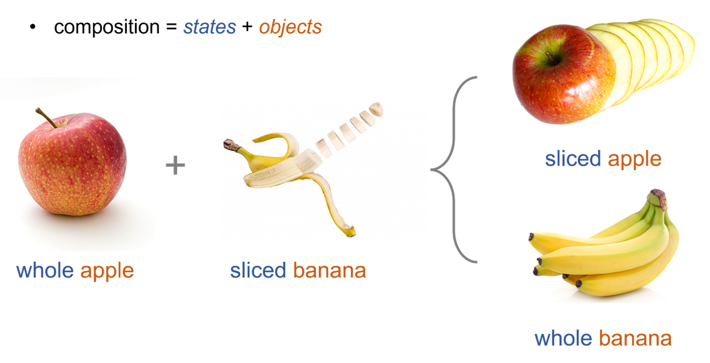

# awesome-compositional-zero-shot-learning: 
A curated list of **Compositional Zero-Shot Learning (CZSL)**

## Compositional Zero-Shot Learning
[Compositional Zero-Shot Learning (CZSL)](https://paperswithcode.com/task/compositional-zero-shot-learning) is a computer vision task in which the goal is to recognize unseen compositions fromed from seen state and object during training. The key challenge in CZSL is the inherent entanglement between the state and object within the context of an image.  
Some example benchmarks for this task are MIT-states, UT-Zappos, and C-GQA. Models are usually evaluated with the Accuracy for both seen and unseen compositions, as well as their Harmonic Mean(HM).

## Paper list
|Year|Pub|Paper|Repo|
|:---:|:---:|:---:|:---:|
|2023|CVPR|[Learning Conditional Attributes for Compositional Zero-Shot Learning](https://openaccess.thecvf.com/content/CVPR2023/papers/Wang_Learning_Conditional_Attributes_for_Compositional_Zero-Shot_Learning_CVPR_2023_paper.pdf)|[code](https://github.com/wqshmzh/CANet-CZSL)
|2023|CVPR|[Learning Attention As Disentangler for Compositional Zero-Shot Learning](https://openaccess.thecvf.com/content/CVPR2023/papers/Hao_Learning_Attention_As_Disentangler_for_Compositional_Zero-Shot_Learning_CVPR_2023_paper.pdf)|[code](https://github.com/haoosz/ade-czsl)
|2023|CVPR|[Decomposed Soft Prompt Guided Fusion Enhancing for Compositional Zero-Shot Learning](https://openaccess.thecvf.com/content/CVPR2023/papers/Lu_Decomposed_Soft_Prompt_Guided_Fusion_Enhancing_for_Compositional_Zero-Shot_Learning_CVPR_2023_paper.pdf)|
|2023|WACV|[Learning Attention Propagation for Compositional Zero-Shot Learning](https://openaccess.thecvf.com/content/WACV2023/papers/Khan_Learning_Attention_Propagation_for_Compositional_Zero-Shot_Learning_WACV_2023_paper.pdf)
|2023|AAAI|[Leveraging Sub-class Discimination for Compositional Zero-Shot Learning](https://ojs.aaai.org/index.php/AAAI/article/view/25168)|
|2022|ECCV|[Learning Invariant Visual Representations for Compositional Zero-Shot Learning](https://www.ecva.net/papers/eccv_2022/papers_ECCV/papers/136840335.pdf)
|2022|CVPR|[Siamese Contrastive Embedding Network for Compositional Zero-Shot Learning](https://openaccess.thecvf.com/content/CVPR2022/papers/Li_Siamese_Contrastive_Embedding_Network_for_Compositional_Zero-Shot_Learning_CVPR_2022_paper.pdf)|[code](https://github.com/XDUxyLi/SCEN-master)
|2022|CVPR|[KG-SP: Knowledge Guided Simple Primitives for Open World Compositional Zero-Shot Learning](https://openaccess.thecvf.com/content/CVPR2022/papers/Karthik_KG-SP_Knowledge_Guided_Simple_Primitives_for_Open_World_Compositional_Zero-Shot_CVPR_2022_paper.pdf)|[code](https://github.com/ExplainableML/KG-SP)
|2021|NIPS|[Independent Prototype Propagation for Zero-Shot Compositionality](https://arxiv.org/pdf/2106.00305.pdf)|[code](https://github.com/FrankRuis/protoprop)
|2021|NIPS|[Environment Generation for Zero-Shot Compositional Reinforcement Learning](https://proceedings.neurips.cc/paper/2021/file/218344619d8fb95d504ccfa11804073f-Paper.pdf)|[code](https://github.com/uqzhichen/Awesome-compositional-zero-shot-learning/blob/main)
|2021|CVPR|[Learning Graph Embeddings for Compositional Zero-shot Learning](https://openaccess.thecvf.com/content/CVPR2021/papers/Naeem_Learning_Graph_Embeddings_for_Compositional_Zero-Shot_Learning_CVPR_2021_paper.pdf)|[code](https://github.com/ExplainableML/czsl)
|2021|CVPR|[Open World Compositional Zero-Shot Learning](https://openaccess.thecvf.com/content/CVPR2021/papers/Mancini_Open_World_Compositional_Zero-Shot_Learning_CVPR_2021_paper.pdf)|[code](https://github.com/ExplainableML/czsl)
|2020|NIPS|[A causal view of compositional zero-shot recognition](https://arxiv.org/pdf/2006.14610.pdf)|[code](https://github.com/nv-research-israel/causal_comp)
|2020|NIPS|[Compositional Zero-Shot Learning via Fine-Grained Dense Feature Composition](https://khoury.neu.edu/home/eelhami/publications/neurips20_CompositionZSL.pdf)|[code](https://github.com/hbdat/neurIPS20_CompositionZSL)
|2020|CVPR|[Symmetry and group in attribute-object compositions](https://openaccess.thecvf.com/content_CVPR_2020/papers/Li_Symmetry_and_Group_in_Attribute-Object_Compositions_CVPR_2020_paper.pdf)|[code](https://github.com/DirtyHarryLYL/SymNet)
|2019|ICCV|[Task-Driven Modular Networks for Zero-Shot Compositional Learning](https://arxiv.org/pdf/1905.05908.pdf)|[code](https://github.com/facebookresearch/taskmodularnets)
|2019|ICCV|[Adversarial fine-grained composition learning for unseen attribute-object recognition](https://openaccess.thecvf.com/content_ICCV_2019/papers/Wei_Adversarial_Fine-Grained_Composition_Learning_for_Unseen_Attribute-Object_Recognition_ICCV_2019_paper.pdf)|
|2018|ECCV|[Attributes as Operators: Factorizing Unseen Attribute-Object Compositions](https://openaccess.thecvf.com/content_ECCV_2018/papers/Tushar_Nagarajan_Attributes_as_Operators_ECCV_2018_paper.pdf)|[code](https://github.com/Tushar-N/attributes-as-operators)
|2017|CVPR|[From Red Wine to Red Tomato: Composition with Context](https://www.ri.cmu.edu/wp-content/uploads/2017/12/composing_cvpr17.pdf)|[code](https://github.com/imisra/composing_cvpr17)
